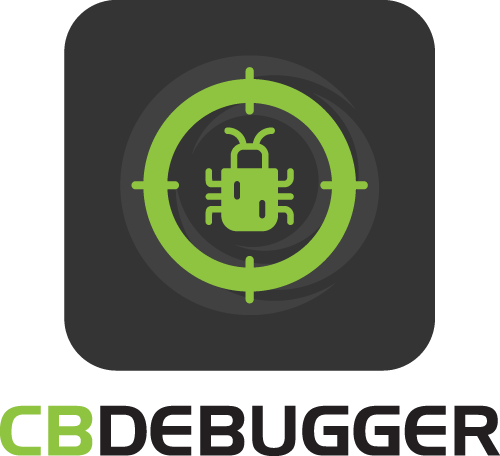

# Introduction



## Welcome To The ColdBox Debugger Module

The ColdBox Debugger module is a lightweight performance monitor and profiling tool for ColdBox applications. It can generate a nice debugging panel on every rendered page or a dedicated visualizer to make your ColdBox application development nicer, more funner and greater! Yes, funner is a word!


### Capabilities

The ColdBox debugger is a lightweight performance monitor and profiler for your ColdBox applications. It tracks your requests, whether Ajax, traditional, or REST, its environment, execution, etc. Here is a listing of some of the capabilities you get with the ColdBox Debugger:

* Track all incoming requests to your applications in memory or offloaded cache
* Track exceptions and execution environment
* Track incoming HTTP requests, parameters, body, and much more
* Track final request collections
* Track Hibernate and `cborm` queries, criteria queries, and session stats
* Track `qb` and `quick` queries, entities, and stats
* Tap into LogBox via our Tracer messages and discover logging on a per-request basis
* Profile execution and results of **ANY** model object
* Profile execution of **ANY** ColdBox interception point
* Custom Timer helpers for adding timing methods and annotations anywhere in your code
* Profile your production or development apps with ease
* Track ColdBox modules and lifecycles
* Highly configurable & extensible
* Track Adobe ColdFusion Queries (ColdFusion 2018+)
* Track Lucee Queries

### System Requirements

* Lucee 5+
* ColdFusion 2018+
* ColdBox 6+

## Versioning <a href="#versioning" id="versioning"></a>

ColdBox Debugger is maintained under the [Semantic Versioning](http://semver.org) guidelines as much as possible. Releases will be numbered in the following format:

```
<major>.<minor>.<patch>
```

And constructed with the following guidelines:

* Breaking backward compatibility bumps the major (and resets the minor and patch)
* New additions without breaking backward compatibility bumps the minor (and resets the patch)
* Bug fixes and misc changes bumps the patch

## License <a href="#license" id="license"></a>

Apache 2 License: [http://www.apache.org/licenses/LICENSE-2.0](https://www.apache.org/licenses/LICENSE-2.0)​

### Important Links

* Source: https://github.com/coldbox-modules/cbdebugger
* ForgeBox: https://www.forgebox.io/view/cbdebugger
* Community: https://community.ortussolutions.com/c/box-modules/cbdebugger/38
* Issues: https://ortussolutions.atlassian.net/browse/CBDEBUGGER
* Changelog


## ​ <a href="#important-links" id="important-links"></a>
