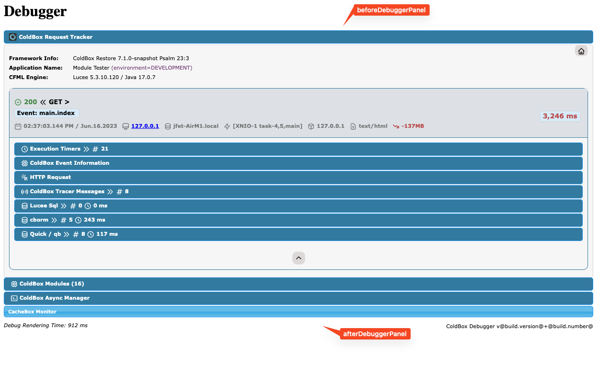
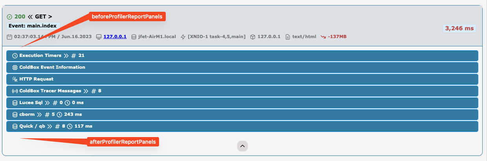

# Debugger Events

The debugger can be extended by listening to several events it fires.  Here is a collection of such events and the data they emit.

<table><thead><tr><th width="370">Event</th><th>Description</th></tr></thead><tbody><tr><td><code>beforeDebuggerPanel</code></td><td>Before the debugger panel is rendered</td></tr><tr><td><code>afterDebuggerPanel</code></td><td>After the last debugger panel is rendered</td></tr><tr><td><code>beforeProfilerReportPanels</code></td><td>Before any individual profiler report panels are rendered</td></tr><tr><td><code>afterProfilerReportPanels</code></td><td>After any individual profiler report panels are rendered</td></tr><tr><td><code>onDebuggerLoad</code></td><td>Fires after the module has fully loaded and been configured with all runtime settings</td></tr><tr><td><code>onDebuggerUnload</code></td><td>Fires after the module is unloaded</td></tr><tr><td><code>onDebuggerRequestTrackerCreation</code></td><td>When the request tracker has been created and placed in request scope</td></tr><tr><td><code>onDebuggerProfilerRecording</code></td><td>Before the request tracker is saved in the profiler, last chance to influence the recording</td></tr></tbody></table>

### beforeDebuggerPanel / afterDebuggerPanel

<figure><figcaption>
Location of UI Events
</figcaption></figure>

| Data              | Description                       |
| ----------------- | --------------------------------- |
| `debuggerConfig`  | The debugger configuration struct |
| `debuggerService` | The debugger service object       |

### beforeProfilerReportPanels / afterProfilerReportPanels

<figure><figcaption>
Location of UI Events
</figcaption></figure>

| Data              | Description                        |
| ----------------- | ---------------------------------- |
| `debuggerConfig`  | The debugger configuration struct  |
| `debuggerService` | The debugger service object        |
| `profiler`        | The full profiler report structure |

### onDebuggerLoad / onDebuggerUnload

_No event data emitted_

### onDebuggerRequestTrackerCreation

This event is fired once the debugger is ready to start tracking the request. You can use the structure to incorporate anything into it.

| Data             | Description                                                                                |
| ---------------- | ------------------------------------------------------------------------------------------ |
| `requestTracker` | The request tracker structure you can use to add your own data collection for the request. |

### onDebuggerProfilerRecording

This event is fired right before the request tracker struct is stored in permanent storage. Your last chance to add data into the tracker structure.

| Data             | Description                                                                                |
| ---------------- | ------------------------------------------------------------------------------------------ |
| `requestTracker` | The request tracker structure you can use to add your own data collection for the request. |

