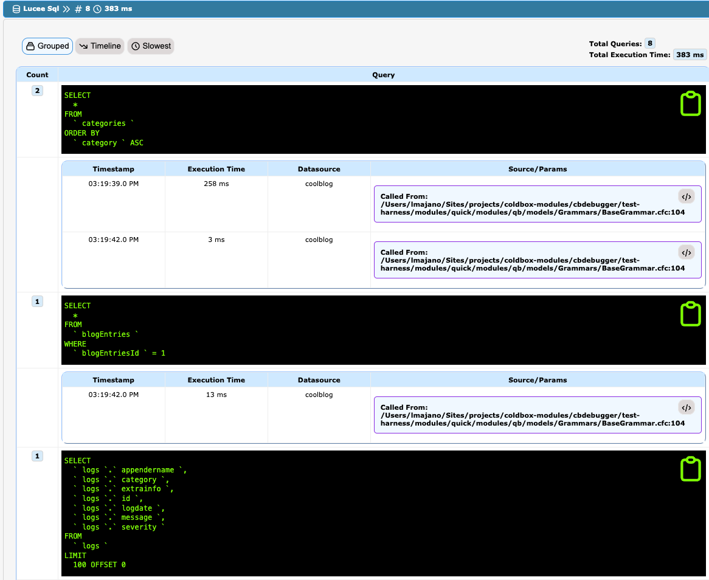

# Lucee SQL

The `luceeSql` collector can be activated if you are in a Lucee engine and it will track all SQL calls made by your application.  You can event choose to show the biding parameters or not.

```cfscript
// Lucee SQL Collector
luceeSql   : { enabled : false, expanded : false, logParams : true }
```

### Configuration

<table><thead><tr><th width="149">Key</th><th width="120">Type</th><th width="147">Default Value</th><th>Description</th></tr></thead><tbody><tr><td><code>enabled</code></td><td>Boolean</td><td>false</td><td>Enable the collector</td></tr><tr><td><code>expanded</code></td><td>Boolean</td><td>false</td><td>Expand the panel by default or not</td></tr><tr><td><code>logParams</code></td><td>Boolean</td><td>true</td><td>Log the binding query parameters</td></tr></tbody></table>

<figure><figcaption></figcaption></figure>

