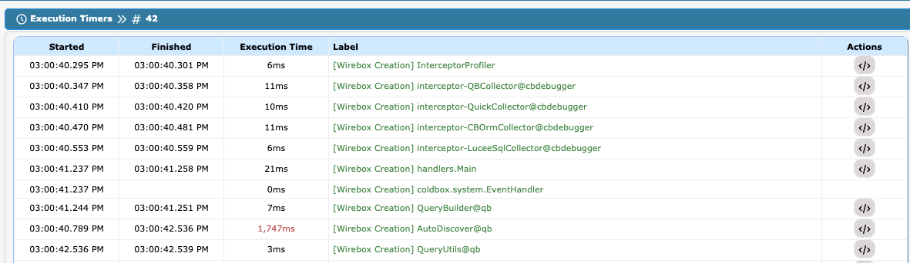

# WireBox Creations

There will be cases where you need to test the performance of the creation of certain objects in WireBox. You can do so by activating the `profileWireBoxObjectCreation` setting in the `requestTracker`. Once enabled, you will see the profiling of all objects created by WireBox in the debug timers.

```cfscript
requestTracker : {
    ...
    profileWireBoxObjectCreation : true
    ...
}
```

<figure><figcaption><p>WireBox Creations</p></figcaption></figure>
