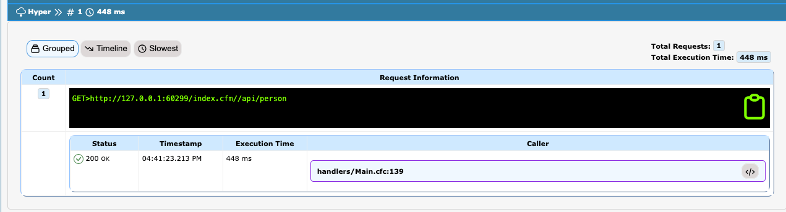

# What's New With 4.2.0

CBDebugger 4.2 comes action-packed with tons of new features, improvements and bug fixes.  Let's check out the major areas of improvement.

### Hyper Collector

<figure><figcaption></figcaption></figure>

You can now track Hyper http/s requests right in a new panel.  It will also aggregate the request's total time, slowest, grouped, and timeline.  It also comes with some great options for configuration:

```json
// Hyper Collector
hyper    : {
	enabled         : false,
	expanded        : false,
	logResponseData : false,
	logRequestBody  : false
}
```

### Lucee SQL Collector

<figure><figcaption></figcaption></figure>

The ColdBox debugger can now profile any SQL running via Lucee queries.  It will provide grouped, timeline, and slowest views as well.  However, you must make sure that Lucee is in debugging mode.

> **IMPORTANT** Please note that to use this feature the engine must have two debugging settings enabled

```json
"debuggingDBEnabled":"true",
"debuggingEnabled":"true",
```

You can easily add those to your `.cfconfig.json` or enable it under the `Debugging` panel in the Lucee Admin.

<figure><figcaption></figcaption></figure>

Here are the configuration settings available for it:

```js
luceeSql : {
	enabled : true,
	expanded : false,
	logParams : true
},
```

### Heap Dump Support

<figure><figcaption><p>Create a Java Heap Dump</p></figcaption></figure>

You now can generate Java heap dumps from the debugger visualizer so you can analyze the heap offline.  Great for debugging memory leaks or just system stability.

### New Request Dock

The request dock has now been cleaned up to only show the request's information and the UI updated for a better and seamless dock UI.  The rest of the information has been moved to the visualizer at the `/cbdebugger` entry point. &#x20;

<figure><figcaption><p>New Request Dock</p></figcaption></figure>

Once you click on the dock, it will expand to show the current request's debugging information.

<figure><figcaption><p>Expanded Dock</p></figcaption></figure>

### Improved SQL/JSON Formatting

We have added new improvements to visualizing SQL and JSON in the context panels.

<figure><figcaption></figcaption></figure>

<figure><figcaption></figcaption></figure>

<figure><figcaption></figcaption></figure>

### Add Timers Manually

You can now add timers manually into the tracking facilities via the `Timer` object's `add()` method or via the `TimerDelegate` and the `addCBTimer()` method.

```cfscript
/**
 * Add a timer to the stack manually. You will need the label, 
 * executionTime and stoppedAt timestamps
 *
 * @label         The label to use as a timer label
 * @executionTime The execution time in ms to register
 * @startedAt     The date time the timer was started
 * @stoppedAt     The date time the timer was stopped
 * @metadata      A struct of metadata to store in the execution timer
 * @parent        An optional parent label
 * @type          The type of execution timed: request, view-render, layout-render, event, renderer
 */
function add(
	required label,
	required executionTime,
	startedAt       = now(),
	stoppedat       = now(),
	struct metadata = {},
	parent          = "",
	type            = "timer"
)
```

You can get access to the `Timer` object in different ways:

```cfscript
// Get in your layouts/handlers/views/interceptors
getInstance( "Timer@cbDebugger" )
// Inject
property name="timer" inject="Timer@cbdebugger"
// ColdBox 7 Delegates
component delegates="TimerDelegate@cbdebugger"{}
```


***

## Release Notes

### Added

* New `HyperCollector` so you can now track hyper requests if enabled
* `Timer` can now add timers a-la-carte via the `add()` method
* `TimerDelegate` now has a `addCBTimer()` method
* New fast and furious and tiny SQL/JSON Formatter
* New `LuceeSqlCollector` you can use to profile all SQL calls in Lucee
* New `luceeSql` configuration to control the Lucee SQL calls collector
* Changed the `instance` argument to `any` in the `debuggerService.openInEditorURL` to allow for a flat representational string of the URL to open in the editor.
* Ability to download a heap dump snapshot from the visualizer

### Changed

* The request panel dock is now a real dock and the only one presented, the rest are only show in the visualizer
* The `requestTracker.expanded` option is now removed, it's always expanded for visualizer and contracted for the dock

### Improved

* Updated test harness UI to make it easier to create debugging events

### Fixed

* Dumb whitespace added by CFML engines when doing inline `<pre>#method()#</pre>` calls.
* Better error handling when Debugger assets are not compiled instead of a cryptic error message: `The parameter [str] to function [closure_m] is required but was not passed in.`
